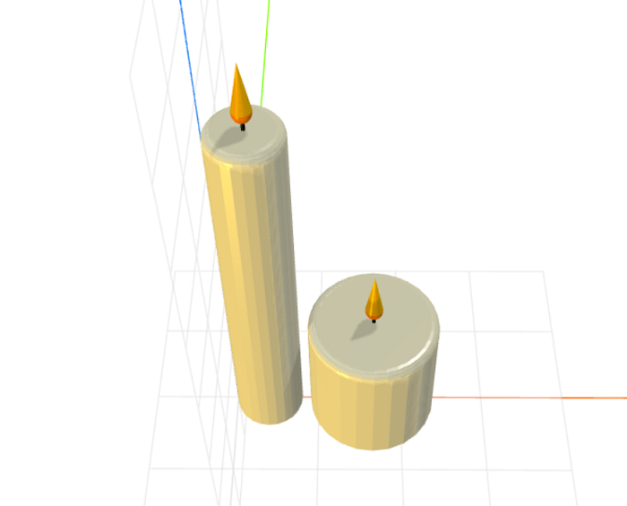

# craft-candle

Parameterized candle model.

### Install
	$ npm install craft-candle

### Parameters
- width: adjusts width of candle
- height: adjusts height of candle

### Example
```html
<craft>
	<craft name="candle" module="calebhsu/craft-candle"/>
	<row spacing="1" align="y50">
        <candle></candle>
        <candle width="15" height="15"></candle>
    </row>
</craft>
```

