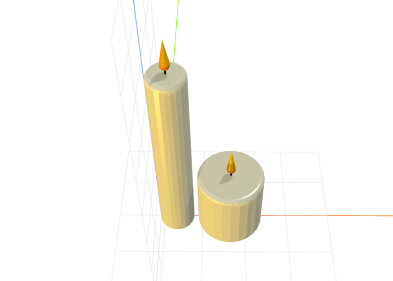

# craft-candle

Parameterized candle model.

### Install
	$ npm install craft-candle

### Parameters
- width: adjusts width of candle
- height: adjusts height of candle

### Example
```html
<craft>
	<craft name="candle" module="calebhsu/craft-candle"/>
	<lineup spacing="2">
		<scale factor="2">
			<candle height="15"></candle>
		</scale>
		<candle width="15" height="10"></candle>
		<candle></candle>
	</lineup>
</craft>
```

